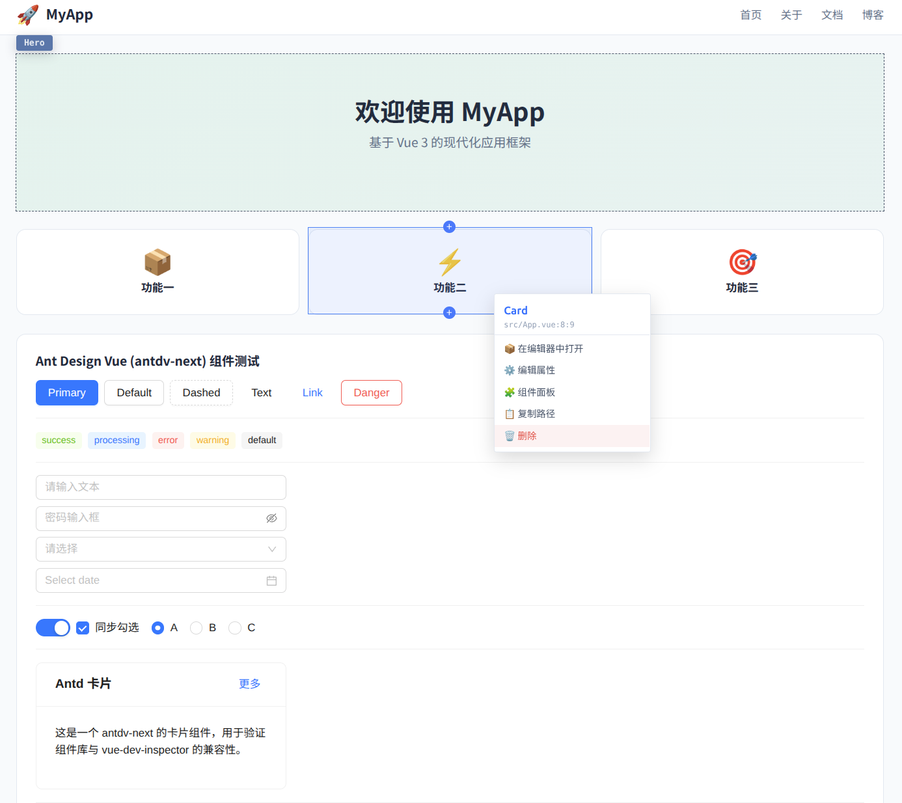

## 基于 AST 遍历 精确定位 Vue 组件源码 设计器

通过 `@vue/compiler-sfc` 解析 AST，overlay 子工程独立编译审查 UI，pnpm monorepo 多包架构，可视化编辑属性 / 插入 / 删除 / 移动。

### 安装

```
pnpm add -D @vue-dev-inspector/core
```

### 接入示例

```ts
// vite.config.ts
import { defineConfig } from "vite";
import vue from "@vitejs/plugin-vue";
import vueDevInspector from "@vue-dev-inspector/core";
// 简易组件物料
import antdv from "@vue-dev-inspector/antdv";

export default defineConfig({
  plugins: [
    // ⚠️ vueDevInspector 必须放在 vue() 之前
    vueDevInspector({
      // dev 模式下启用（默认 true）
      enabled: true,
      // 注入的属性名
      attrName: "data-source-file",
      // 第三方组件 fallthrough attrs 丢失审查标记（inheritAttrs:false / Teleport）
      // 用 display:contents 的 span 包裹，标记挂 span
      wrapComponents: ["a-date-picker", "a-input-password"],
      // ★ monorepo 多根：每个 entry 一个可被审查/编辑的子工程根
      // 默认未配置时使用 Vite 的 config.root（单根）。
      // 不在任一根下的 .vue 不会注入审查标记。
      // 路径支持绝对路径或相对于 config.root。
      // projectRoots: ["./", "../admin", "../shared"],
      // 编辑器类型 @default 'vscode'
      editor: "vscode",
      // 默认启用齿轮按钮
      toggleBtn: true,
      // 组件面板拓展 ——
      // 通过 plugin 形式注入；将来支持 element-plus / 自定义组件目录，
      // 只需新增对应包并在此处 append 工厂调用。
      componentConfig: [antdv()],
    }),
    vue(),
  ],
});
```

完整示例见 `packages/demo/vite.config.ts`。

### 启动 Demo

```
pnpm run build:core
pnpm run dev:demo
```

启动后浏览器中：

1. 按 `Alt+Shift+I`（默认快捷键，可配置）进入审查模式
2. 右下角齿轮按钮也可开启审查
3. 审查中按 `Esc` 逐级关闭（drag / drawer / panel / 审查）
4. 按住 `Ctrl` 拖动已选中元素可调整位置

[在线体验](https://1i0k2-loc.hf.space)

属性编辑与ide联动
<video src="https://github.com/user-attachments/assets/6ade0f49-0db7-4b89-8975-14dc1f3cf656" controls="controls" width="500" height="300"></video>

内置拓展模板组件插入
<video src="https://github.com/user-attachments/assets/a5e09b30-47ef-4eb0-af6c-81f5684917c5" controls="controls" width="500" height="300"></video>


